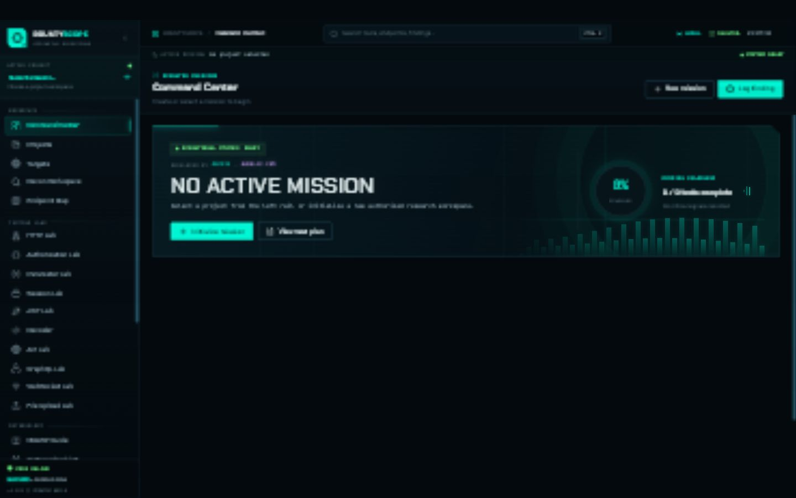

<div align="center">

# BountyScope Ultimate

### Cyberpunk Offensive Security Operations Console

**Developed by [Sachin](https://github.com/sachineo) × [skoolic.com](https://skoolic.com)**

[](https://react.dev/)
[](https://www.typescriptlang.org/)
[](https://www.electronjs.org/)
[](https://sqlite.org/)

A local-first desktop workbench that brings authorized security research, attack-surface mapping, testing labs, evidence, findings, and reporting into one focused interface.

[🌐 Live Web Demo](https://sachineo.github.io/bountyscope-ultimate/) • [Features](#features) • [Installation](#installation) • [How to use](#how-to-use) • [Architecture](#architecture) • [Contributing](#contributing)

</div>



> [!IMPORTANT]
> BountyScope is intended only for systems you own or have explicit written permission to test. It is not designed for unauthorized access or activity.

> [!NOTE]
> The [browser demo](https://sachineo.github.io/bountyscope-ultimate/) uses safe sample data and is designed for instant exploration. Install the desktop edition for the local SQLite database, evidence file workflows, and live HTTP tooling.

## Why BountyScope?

Security research is often scattered across proxy history, notes, terminal output, screenshots, spreadsheets, and report drafts. BountyScope provides one mission-oriented workspace for that workflow.

- **Stay organized** — connect projects, targets, endpoints, requests, evidence, and findings.
- **Work locally** — research data remains in the local SQLite workspace.
- **Test methodically** — use specialized labs and an OWASP-aligned checklist.
- **Preserve proof** — capture evidence and activity history while testing.
- **Report faster** — move validated findings into reusable disclosure formats.
- **Reduce tool switching** — keep the core research workflow in one desktop app.

## Features

### Operations and scope

- Animated cyberpunk command center with live mission telemetry
- Project and organization management
- Target scope, asset type, bounty eligibility, severity, and exclusion tracking
- Recon host workspace and endpoint mapping
- Global command palette using `Ctrl+K` or `/`

### Testing labs

- HTTP request and response workbench
- Authorization and account-comparison lab
- Parameter mutation workspace
- Session and cookie testing
- JWT inspection and history
- API and GraphQL labs
- WebSocket testing workspace
- File-upload testing guide
- Decoder and transformation utilities

### Research workflow

- OWASP testing methodology
- Progress-aware testing checklist
- Payload library with categorized probes
- Tool reference guide
- Research notes and activity timeline
- Evidence vault
- Finding management and severity tracking
- Report generation workspace

### Privacy and safety

- Local SQLite database
- No required cloud account
- No automatic telemetry
- Configurable secret masking and log redaction
- Explicit authorized-use guidance

## Application preview

The interface uses animated telemetry, scan effects, responsive charts, a tactical action deck, a project switcher, severity intelligence, testing coverage, and contextual next-step recommendations.

The browser preview shows the visual shell. Database, filesystem, and request features run inside the Electron desktop application.

## Installation

### Requirements

- Windows 10/11, Linux, or macOS
- [Node.js](https://nodejs.org/) `20.19+` or `22.12+`
- npm
- Git, if cloning the repository

### Windows: easiest method

1. Download the repository using **Code → Download ZIP**, or clone it.
2. Extract the ZIP.
3. Double-click **`LAUNCH_BOUNTYSCOPE.bat`**.
4. On the first run, the launcher installs dependencies and creates the desktop build.

### Clone and run

```bash
git clone https://github.com/sachineo/bountyscope-ultimate.git
cd bountyscope-ultimate
npm install
npm run launch
```

### Development mode

```bash
npm install
npm start
```

### Production renderer build

```bash
npm run build:vite
```

### Desktop installer build

```bash
npm run build
```

Build output is written to `release/`.

## How to use

1. **Create a mission** — add a project for the authorized program or engagement.
2. **Define the target scope** — record allowed assets, rules, restrictions, and exclusions.
3. **Map the attack surface** — add recon hosts and discovered endpoints.
4. **Build the test plan** — open the checklist and track coverage.
5. **Run focused tests** — use the HTTP, authorization, session, JWT, API, GraphQL, WebSocket, parameter, or upload labs.
6. **Capture evidence** — preserve files, notes, request context, and activity.
7. **Validate findings** — record severity, impact, reproduction steps, and remediation.
8. **Generate the report** — prepare the finding for the chosen disclosure workflow.

## Keyboard shortcuts

| Shortcut | Action |
|---|---|
| `Ctrl+K` | Open the global command palette |
| `/` | Open search when an input is not focused |
| `Ctrl+Enter` | Send the current HTTP request |
| `Ctrl+N` | Create a request tab |
| `Ctrl+S` | Save the current item |
| `F5` | Resend the current request |

## Technology

| Layer | Technology |
|---|---|
| Desktop runtime | Electron |
| Interface | React + TypeScript |
| Build system | Vite |
| Local database | SQLite via `better-sqlite3` |
| Charts | Recharts |
| Editor | Monaco Editor |
| UI primitives | Radix UI |
| Icons | Lucide |
| HTTP client | Axios |

## Architecture

```text
bountyscope-ultimate/
├── electron/            # Desktop process, SQLite schema, IPC, file and HTTP services
├── public/              # Application icons and static assets
├── src/
│   ├── context/         # Shared application state
│   ├── layout/          # Shell, sidebar and command palette
│   ├── lib/             # Desktop API bridge
│   └── pages/           # Dashboard, labs, research and reporting modules
├── LAUNCH_BOUNTYSCOPE.bat
├── package.json
└── vite.config.ts
```

The React renderer communicates with Electron through a context-isolated preload bridge. Database, filesystem, external navigation, and raw HTTP requests remain in the desktop process.

## Data location and backups

BountyScope creates its SQLite database inside the operating system's Electron user-data directory. The exact path is displayed under **About** and **Settings → Storage**. Use **Create Backup Now** before major upgrades or experiments.

Do not commit real engagement databases, evidence, authorization tokens, cookies, private reports, or client information to GitHub.

## Project status

BountyScope Ultimate is under active development. The current version is `1.0.0`. Treat important engagement data carefully and keep independent backups.

## Contributing

Bug reports, design improvements, documentation fixes, and well-scoped feature contributions are welcome. Read [CONTRIBUTING.md](CONTRIBUTING.md) before opening a pull request.

For security-sensitive reports, follow [SECURITY.md](SECURITY.md) instead of opening a public issue.

## Responsible use

You are responsible for complying with applicable law, program rules, written scope, rate limits, privacy obligations, and data-handling requirements. Never use BountyScope against systems without authorization.

## Credits

Created and developed by **[Sachin](https://github.com/sachineo)**  
Company and product partner: **[skoolic.com](https://skoolic.com)**

If this project helps your research workflow, consider starring the repository and sharing constructive feedback.
